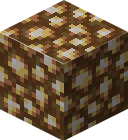

<div>
  
  <br>
  <h1>Glowstone</h1>
  <p>Glowstone is a Golang library for reading and writing Minecraft Bedrock Edition addon.</p>
</div>

# Todo
- BP
  - [x] Animation
  - [x] Animation Controller
  - [x] Block
  - [x] Entity
  - [x] Item
  - [x] Loot Table
  - [x] Recipe
  - [ ] Spawn Rule
  - [ ] Structure
- RP
  - [x] Animation Controller
  - [x] Animation
  - [x] Attachable
  - [x] Entity
  - [x] Fog
  - [ ] Material
  - [x] Model
  - [x] Particle
  - [x] Render Controller
  - [x] Item Texture
  - [ ] sounds.json
  - [x] sound_definitions.json
  - [x] blocks.json
  - [x] terrain_textures.json

- Misc
  - [x] Make a field for saving filename, since it will duplicate if thee filename doesn't match with the identifier.
  - [x] Rework project fields, ```glowstone.NewBPAnimationController -> glowstone.BP.AnimationController.New("asdf")```
  - [ ] Remove unnecessary pointer
  - [ ] Add project setting to minify JSON
  - [ ] Add format version setting, especially for item, block, and entity

- Util
  - [ ] BBModel Parser 
- [ ] Documentation

- Format Version
  - [ ] Item
  - [ ] Block
  - [ ] Entity (RP)
  - [ ] Blocks (RP)
  - [ ] Attachable (RP)

  # Quick Start
  ```go
  package main

  import (
    "path/filepath"
    "github.com/respectZ/glowstone"
  )

  func main() {
    // Create a project environment.
    project := glowstone.NewProject()

    // Set your RP and BP path.
    // Below is the default value.
    project.BP.Path = filepath.Join("packs", "BP")
    project.RP.Path = filepath.Join("packs", "RP")

    // Preload BP and RP packs from the path.
    // Warning: this is unstable and may cause some errors for some compabilities.
    // This isn't necessary if you didn't need any read operation.
    project.Preload()

    // Do something here.

    project.Save()
  }
  ```